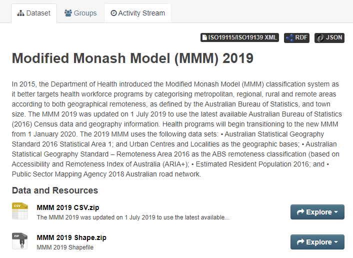
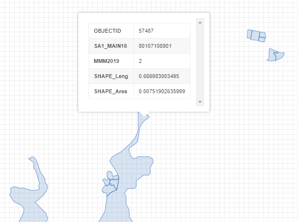
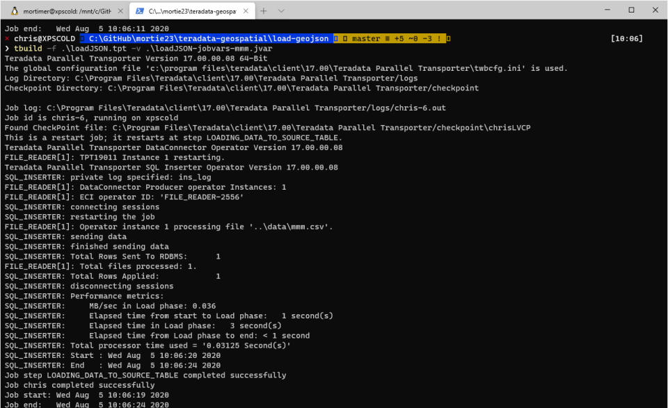

Document Control
================

Authors
-------

  Business Term         | Title           | Date         |Role
  ----------------------| ----------------| ------------| ------------
  Christopher Mortimer  | Data Analyst    |2017-08-07   | Dev

Version Management
------------------

  Version   |Author                | Date        | Content
  --------- |--------------------- |------------ | -------------------------------------
  V1.0      | Christopher Mortimer | 2017-08-07  | Dev

 

Table of Contents
-----------------

[Document Control](#document-control)

[Authors ](#authors)

[Version Management](#version-management)

[Introduction](#introduction)

[Prerequisite](#prerequisite)

[Content](#content)

[Tutorial](#tutorial)

[Convert from GeoJSON to ST_Geometry](#Convert-from-GeoJSON-to-ST_Geometry)


Introduction
============

This Teradata Geospatial Tutorial covers 

1. geospatial data loading
1. geospatial queries

The tutorial currently works Teradata 16.20 version.

Prerequisite 
------------

This tutorial was designed on a Windows 10 computer with:
1. Download Teradata express 16.20 VM (http://downloads.teradata.com/download)
1. Download Teradata Tools and Utilities 16.20 (http://downloads.teradata.com/download)
1. Teradata Studio 16.20 (http://downloads.teradata.com/download)
1. Python 3.8.2

Content
----------------

The following components are provided with this tutorial:

- tutorial.md (instructions)
- geo-convert.py (script to convert shape file to GeoJSON)
  - ./data (where the GeoJSON is written to)
  - ./load-geojson (the load scripts to get the GeoJSON into Teradata)
  - ./shape-files (source Shape Files)
  - ./dba (setup of the database)

Tutorial
========

Tutorial Scenario
-----------------

We have a shape file and we want to load it to a ST_Geometry field in Teradata.
We do not have access to a 32bit OS or java CLI so using the Teradata java tool is not an option.
We do have access to Python.

Database Creation and Grants
----------------------------

A database needs to be created to contain the geospatial data and access to geospatial features.
Example that needs to be run as DBC against your VM.

```sql
-- Create database with 100 Mb
CREATE DATABASE PRD_ADS_HWD_WDAPGRP_DB FROM DBC AS PERM = 100000000;

-- General database grants
GRANT DROP DATABASE ON PRD_ADS_HWD_WDAPGRP_DB TO DBC;
GRANT DROP DATABASE ON PRD_ADS_HWD_WDAPGRP_DB TO DBC;
GRANT CREATE TABLE ON PRD_ADS_HWD_WDAPGRP_DB TO DBC;
GRANT CREATE PROCEDURE ON PRD_ADS_HWD_WDAPGRP_DB TO DBC;
GRANT SELECT ON PRD_ADS_HWD_WDAPGRP_DB TO DBC;
GRANT UPDATE ON PRD_ADS_HWD_WDAPGRP_DB TO DBC;
GRANT DELETE ON PRD_ADS_HWD_WDAPGRP_DB TO DBC;
GRANT INSERT ON PRD_ADS_HWD_WDAPGRP_DB TO DBC;

-- Geospatial specific grants
GRANT EXECUTE FUNCTION ON SYSSPATIAL TO PRD_ADS_HWD_WDAPGRP_DB WITH GRANT OPTION;
GRANT SELECT ON SYSSPATIAL TO PRD_ADS_HWD_WDAPGRP_DB; 
GRANT EXECUTE PROCEDURE ON SYSSPATIAL TO PRD_ADS_HWD_WDAPGRP_DB;
GRANT EXECUTE FUNCTION ON SYSSPATIAL.TESSELLATE_SEARCH TO PRD_ADS_HWD_WDAPGRP_DB WITH GRANT OPTION;
GRANT EXECUTE FUNCTION ON SYSSPATIAL.TESSELLATE_INDEX TO PRD_ADS_HWD_WDAPGRP_DB WITH GRANT OPTION;
GRANT UDTUSAGE ON SYSUDTLIB TO PRD_ADS_HWD_WDAPGRP_DB;
```

Table Creation and Data Loading
-------------------------------

### Staging Table

Staging table captures the JSON data.

```sql
-- Create the staging table
CREATE TABLE PRD_ADS_HWD_WDAPGRP_DB.GEO_JSON_STAGING (
  ID_COL VARCHAR(100)
  , JSON_DATA JSON(16776192)
)
;
```

#### Alternative Using TDGeoImport

If you have a 32 bit OS and Java you can try this.
Use the loading utility `TDGeoImport`. 
It loads directly from "ESRI Shape files".

> Command line arguments  
> -l \<system name or ip address\>/\<user name\>,\<user password\>  
> -f filename of shape file to be loaded (extension .shp)   
> -b is followed by the database name  

TDGeoImport should be run from the `TDGeoimportexport/bin` directory.

To do this:

Create a different staging table:

```sql
-- Create the staging table
CREATE TABLE PRD_ADS_HWD_WDAPGRP_DB.GEO_STAGING (
  ID_COL VARCHAR(100)
  , JSON_DATA ST_Geometry
)
;
```

- Open a command window (I use the Microsoft Terminal from Windows Store)
- Go to the TDGeoimportexport/bin directory by typing cd c:\...\<>\..\TDGeoimportexport/bin
- Run the TDGeoimport from the directory

```sh
java -Xms256m -Xmx512m -classpath .;tdgssconfig.jar;terajdbc4.jar com.teradata.geo.TDGeoImport -l 192.168.0.28/dbc,dbc -s PRD_ADS_HWD_WDAPGRP_DB -f ".\shape-fIles\shape-file.shp" -n GEO_STAGING
```

This will populate the `GEO_STAGING` table with the geospatial column.

### Convert from Shape file to GeoJSON

You will need to have the `geopandas` package in your python environment.

```sh
pip install geopandas
```

For this tutorial we will use the Modified Monash Model shape file that is open data availabel at: 

[Download from data.gov.au](https://data.gov.au/data/dataset/modified-monash-model-mmm-2019)



From the zip, extract the files somewhere, and then modify the Python script `geo-convert.py` to point to your file.  

Run the Python script.

```sh
./geo-convery.py
```

GitHub has a great feature that will automatically show GeoJSON files as polygons on a map.
This is a sample of the records that was create using the following script for testing purposes.

```sh
# Write the first 10 lines to a new file
head mmm-2019-final.json > mmm-2019-sample.json
# Append the last 10 lines to the file created before
tail mmm-2019-final.json >> mmm-2019-sample.json
```



### Load the GeoJSON

Run the TPT script using command line (in this instance using PowerShell in Windows Terminal).
You will need to have installed the Teradata Tools an Utilities to use the `tbuild` CLI application.

```sh
tbuild -f .\loadJSON.tpt -v .\loadJSON-jobvars-mmm.jvar
```



Convert from GeoJSON to ST_Geometry
-----------------------------------

The access layer script can be used to:
1. Parse the JSON using native Teradata JSON syntax
1. Use the Teradata function `GeomFromGeoJSON` to convert the GeoJSON to `ST_Geometry`.

```sql
-- Get the features and geography
SELECT
  A.ID_COL
  , A.OBJECTID
  , GeomFromGeoJSON(A.GEOMETRY_CHAR,4326) AS GEOMETRY
FROM (
  SELECT 
    T.ID_COL
    , T.OBJECTID
    , T.SA1_MAIN16
    , T.MMM2019
    , T.SHAPE_Leng
    , T.SHAPE_Area
    , TRIM(TRAILING ' ' FROM T.GEOMETRY_CHAR) AS GEOMETRY_CHAR
  FROM 
    JSON_TABLE (
    ON PRD_ADS_HWD_WDAPGRP_DB.GEO_JSON_STAGING
    USING 
      ROWEXPR('$.features[*]')
      colexpr('[ 
        { "jsonpath" : "$.properties.OBJECTID","type" : "BIGINT"}
        , { "jsonpath" : "$.properties.SA1_MAIN16","type" : "BIGINT"}
        , { "jsonpath" : "$.properties.MMM2019","type" : "INTEGER"}
        , { "jsonpath" : "$.properties.SHAPE_Leng","type" : "FLOAT"}
        , { "jsonpath" : "$.properties.SHAPE_Area","type" : "FLOAT"}
        , { "jsonpath" : "$.geometry","type" : "CHAR(63000)"}
        ]'
      )
  ) AS T (
    ID_COL
    , OBJECTID
    , SA1_MAIN16
    , MMM2019
    , SHAPE_Leng
    , SHAPE_Area
    , GEOMETRY_CHAR
  )
) AS A
;
```

Points in Polygons
------------------

Once the polygon data is available in Teradata we can use it to find what polygons a point is in.

### Create a sample point

```sql
CREATE TABLE PRD_ADS_HWD_WDAPGRP_DB.GEO_POINTS (
  ID_COL VARCHAR(100) 
  , POINT_GEOMETRY ST_GEOMETRY
)
PRIMARY INDEX(ID_COL)
;

-- Insert sample   
INSERT INTO PRD_ADS_HWD_WDAPGRP_DB.GEO_POINTS VALUES ('1','POINT (149.0723375605 -35.4349675974999)');
```

Now we have the point we can use a spatial join to find what polugon the point is in.

```sql
SELECT 
  POINT.ID_COL
  , POLY.OBJECTID
FROM 
  PRD_ADS_HWD_WDAPGRP_DB.GEO_POINTS POINT
INNER JOIN 
  PRD_ADS_HWD_WDAPGRP_DB.GEO POLY
ON 
  POINT.POINT_GEOMETRY.ST_WITHIN(POLY.GEOMETRY)= 1
;
```

Result

 ID_COL |OBJECTID 
 ------ |-------- 
 1      |   57487
